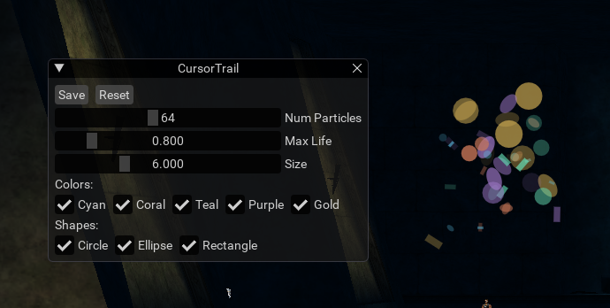

# mqcursortrail
CursorTrail for EverQuest+MacroQuest

# Installation
Clone repository into your MQ Lua folder.

# Usage
Run in game with `/lua run mqcursortrail`.  

Launch at startup by adding above command into `ingame.cfg`.  

To configure the trail, open settings UI with `/cursortrail`.  